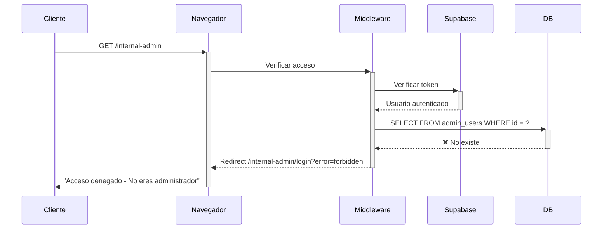
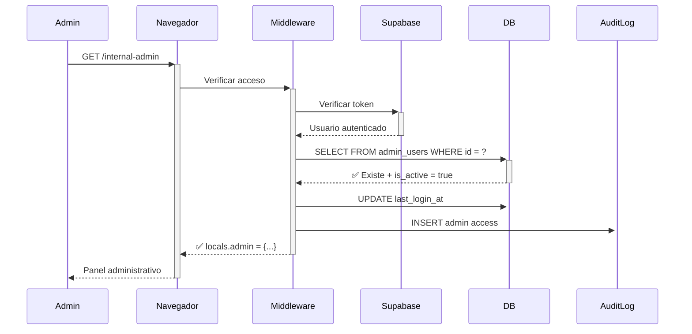
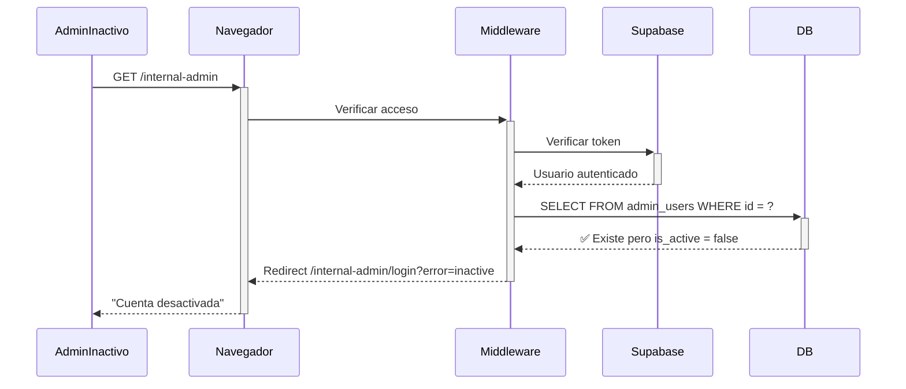

# 🔒 ARQUITECTURA DE SEGURIDAD - SEPARACIÓN TOTAL

## 📋 ÍNDICE

1. [Principios de Seguridad](#principios-de-seguridad)
2. [Separación de Usuarios](#separación-de-usuarios)
3. [Panel Administrativo Oculto](#panel-administrativo-oculto)
4. [Capas de Seguridad](#capas-de-seguridad)
5. [Flujos de Autenticación](#flujos-de-autenticación)
6. [Configuración IP Whitelist](#configuración-ip-whitelist)
7. [Testing de Seguridad](#testing-de-seguridad)
8. [Monitoreo y Auditoría](#monitoreo-y-auditoría)

---

## 🎯 PRINCIPIOS DE SEGURIDAD

### Modelo: Backoffice Completamente Separado

Similar a:
- **Shopify**: tienda pública en `mitienda.com` + admin en `mitienda.myshopify.com/admin`
- **Stripe**: Dashboard completamente separado en `dashboard.stripe.com`
- **WordPress**: Frontend público + `/wp-admin` con credenciales separadas

### Arquitectura Implementada

```
┌─────────────────────────────────────────────────────────────┐
│                     INTERNET PÚBLICO                        │
└─────────────────────────────────────────────────────────────┘
                          │
        ┌─────────────────┴─────────────────┐
        │                                   │
        ▼                                   ▼
┌─────────────────┐              ┌────────────────────┐
│  TIENDA PÚBLICA │              │ PANEL ADMIN OCULTO │
│                 │              │                    │
│ /               │              │ /internal-admin    │
│ /productos      │              │                    │
│ /categoria/*    │              │ ✅ Ruta oculta     │
│ /checkout       │              │ ✅ No indexada     │
│                 │              │ ✅ IP whitelist    │
│ ✅ Sin auth     │              │ ✅ Rate limiting   │
│ ✅ O cliente    │              │ ✅ MFA (futuro)    │
└─────────────────┘              └────────────────────┘
        │                                   │
        ▼                                   ▼
┌─────────────────┐              ┌────────────────────┐
│  auth.users     │              │  admin_users       │
│  (Clientes)     │              │  (Administradores) │
│                 │              │                    │
│ • Solo compran  │              │ • Solo gestionan   │
│ • Ven productos │              │ • Crean productos  │
│ • Ven pedidos   │              │ • Ven todos pedidos│
│ • NO admin      │              │ • NO compran       │
└─────────────────┘              └────────────────────┘
```

---

## 👥 SEPARACIÓN DE USUARIOS

### 1. Usuarios Finales (Clientes)

**Registro:**
```typescript
// Desde la tienda pública
const { data, error } = await supabase.auth.signUp({
  email: 'cliente@example.com',
  password: 'password123'
});

// ❌ NO se agrega a admin_users
// ✅ Solo en auth.users
```

**Permisos:**
- ✅ Ver productos públicos
- ✅ Agregar al carrito
- ✅ Hacer checkout
- ✅ Ver sus propios pedidos
- ❌ Acceder a /internal-admin (bloqueado por middleware)
- ❌ Ver todos los pedidos
- ❌ Crear/editar productos

**Autenticación:**
```
URL: /login (login público de clientes)
Tokens: Cookies httpOnly con scope limitado
RLS: Restricciones en orders (solo sus pedidos)
```

### 2. Administradores

**Registro:**
```sql
-- Paso 1: Crear usuario en Supabase Auth (Dashboard)
-- Email: admin@fashionmarket.com
-- Password: [contraseña segura]

-- Paso 2: Agregar a admin_users (SQL Editor)
INSERT INTO admin_users (id, email, role, full_name, is_active)
VALUES (
  'uuid-from-auth-users',
  'admin@fashionmarket.com',
  'super_admin',
  'Administrador Principal',
  true
);
```

**Permisos:**
- ✅ Gestión completa de productos
- ✅ Gestión de categorías
- ✅ Ver todos los pedidos
- ✅ Gestión de otros admins (si es super_admin)
- ✅ Auditoría de acciones
- ❌ Acceder a checkout desde cuenta admin
- ❌ Comprar productos

**Autenticación:**
```
URL: /internal-admin/login (login separado, ruta oculta)
Tokens: Cookies httpOnly con verificación adicional
Verificación: auth.users + admin_users + is_active
```

---

## 🔐 PANEL ADMINISTRATIVO OCULTO

### Ruta Oculta: `/internal-admin`

**¿Por qué no `/admin`?**
- `/admin` es predecible y fácil de encontrar
- Bots y atacantes escanean automáticamente `/admin`, `/wp-admin`, `/administrator`
- Security by obscurity como capa adicional (no la única)

**Configuración:**

```typescript
// src/middleware.ts
const ADMIN_BASE_PATH = '/internal-admin'; // Cambiar a tu preferencia

// Opciones de nombres seguros:
// - /internal-admin
// - /dashboard-secure
// - /manage-xyz123
// - /backoffice
// - /panel-[random-string]
```

**Ventajas:**
1. ✅ No aparece en búsquedas de Google
2. ✅ No descubierta por bots automáticos
3. ✅ Solo conocida por administradores legítimos
4. ✅ Fácil de cambiar si se compromete

### No Indexación

```html
<!-- src/pages/internal-admin/login.astro -->
<head>
  <meta name="robots" content="noindex, nofollow">
  <meta name="googlebot" content="noindex, nofollow">
</head>
```

### Protección adicional (robots.txt)

```txt
# public/robots.txt
User-agent: *
Disallow: /internal-admin/
Disallow: /api/
```

---

## 🛡️ CAPAS DE SEGURIDAD

### Capa 1: Middleware (Server-Side)

```typescript
// src/middleware.ts
if (url.pathname.startsWith('/internal-admin')) {
  // 1. IP Whitelist (opcional)
  if (ALLOWED_IPS.length > 0 && !ALLOWED_IPS.includes(clientIP)) {
    return new Response('Forbidden', { status: 403 });
  }

  // 2. Rate Limiting
  if (loginAttempts >= 5) {
    return new Response('Too Many Requests', { status: 429 });
  }

  // 3. Token Validation
  const accessToken = cookies.get('sb-access-token');
  if (!accessToken) {
    return redirect('/internal-admin/login?error=unauthorized');
  }

  // 4. Admin Verification (auth.users + admin_users)
  const permissionCheck = await verifyAdminSession(accessToken);
  if (!permissionCheck.allowed) {
    return redirect('/internal-admin/login?error=forbidden');
  }

  // 5. Active Status Check
  if (!permissionCheck.user?.is_active) {
    return redirect('/internal-admin/login?error=inactive');
  }

  // ✅ Todas las capas pasadas
}
```

### Capa 2: Row Level Security (RLS)

```sql
-- Solo service_role puede escribir
CREATE POLICY "Service role can manage products"
  ON products FOR ALL
  TO service_role
  USING (true) WITH CHECK (true);

-- Clientes solo leen productos activos
CREATE POLICY "Anyone can view active products"
  ON products FOR SELECT
  TO anon, authenticated
  USING (is_active = true);
```

### Capa 3: API Validation

```typescript
// src/pages/api/products/create.ts
export const POST: APIRoute = async ({ locals, request }) => {
  // 1. Verificar que es admin
  if (!locals.isAdmin || !locals.admin) {
    return new Response(JSON.stringify({ error: 'Forbidden' }), {
      status: 403
    });
  }

  // 2. Verificar permisos de rol
  const hasPermission = await checkAdminPermission(
    locals.admin.id, 
    AdminRole.EDITOR
  );
  
  if (!hasPermission.allowed) {
    return new Response(JSON.stringify({ error: 'Insufficient permissions' }), {
      status: 403
    });
  }

  // 3. Validación server-side
  const price = parseFloat(data.price);
  if (isNaN(price) || price < 0) {
    return new Response(JSON.stringify({ error: 'Invalid price' }), {
      status: 400
    });
  }

  // 4. Usar service_role (bypass RLS legítimo)
  const supabase = createServerSupabaseClient();
  
  // 5. Registrar en audit_logs
  await logAdminAction({
    adminUserId: locals.admin.id,
    action: 'CREATE',
    tableName: 'products',
    newValues: data
  });
};
```

### Capa 4: Audit Logs

```sql
-- Toda acción administrativa se registra
CREATE TABLE audit_logs (
  id UUID PRIMARY KEY,
  admin_user_id UUID REFERENCES admin_users(id),
  action TEXT NOT NULL,
  table_name TEXT NOT NULL,
  record_id UUID,
  old_values JSONB,
  new_values JSONB,
  ip_address INET,
  user_agent TEXT,
  created_at TIMESTAMPTZ DEFAULT NOW()
);

-- Logs son inmutables (no UPDATE/DELETE)
CREATE POLICY "Service role can insert audit logs"
  ON audit_logs FOR INSERT
  TO service_role
  WITH CHECK (true);
```

---

## 🔄 FLUJOS DE AUTENTICACIÓN

### Flujo 1: Cliente Intenta Acceder al Admin



**Resultado:** Cliente autenticado pero NO admin = BLOQUEADO

### Flujo 2: Admin Válido Accede al Panel



**Resultado:** Admin válido = ACCESO CONCEDIDO

### Flujo 3: Admin Inactivo Intenta Acceder



**Resultado:** Admin desactivado = BLOQUEADO

---

## 🌐 CONFIGURACIÓN IP WHITELIST

### Activar IP Whitelist (Opcional)

```typescript
// src/middleware.ts
const ALLOWED_IPS: string[] = [
  '203.0.113.50',    // Oficina principal
  '198.51.100.25',   // Oficina secundaria
  '192.168.1.100'    // VPN corporativa
];
```

### Ventajas:
- ✅ Solo IPs conocidas pueden acceder
- ✅ Previene ataques desde IPs desconocidas
- ✅ Fácil de auditar

### Desventajas:
- ❌ Dificulta trabajo remoto
- ❌ IPs dinámicas requieren actualización constante
- ❌ Puede bloquear acceso legítimo

**Recomendación:** Usar solo en producción con IPs fijas o VPN corporativa.

### Obtener IP del Cliente

```typescript
const clientIP = request.headers.get('x-forwarded-for')?.split(',')[0] || 
                 request.headers.get('x-real-ip') || 
                 request.headers.get('cf-connecting-ip') || // Cloudflare
                 'unknown';
```

---

## 🧪 TESTING DE SEGURIDAD

### Test 1: Usuario Final NO Puede Acceder al Admin

```bash
# 1. Crear usuario de cliente en Supabase Auth
# Email: cliente@test.com

# 2. Login como cliente desde la tienda pública
curl -X POST https://tu-dominio.com/api/auth/customer-login \
  -H "Content-Type: application/json" \
  -d '{"email":"cliente@test.com","password":"test123"}'

# 3. Intentar acceder al admin (debe ser rechazado)
curl -X GET https://tu-dominio.com/internal-admin \
  -H "Cookie: sb-access-token=TOKEN_DEL_CLIENTE"

# ✅ Esperado: 403 Forbidden o redirect a login con error=forbidden
```

### Test 2: Admin Válido SÍ Puede Acceder

```bash
# 1. Crear usuario admin (Auth + admin_users)
# 2. Login como admin
curl -X POST https://tu-dominio.com/internal-admin/api/login \
  -H "Content-Type: application/json" \
  -d '{"email":"admin@fashionmarket.com","password":"admin123"}'

# 3. Acceder al panel
curl -X GET https://tu-dominio.com/internal-admin \
  -H "Cookie: sb-access-token=TOKEN_DEL_ADMIN"

# ✅ Esperado: 200 OK con panel administrativo
```

### Test 3: Admin Inactivo NO Puede Acceder

```sql
-- Desactivar admin
UPDATE admin_users 
SET is_active = false 
WHERE email = 'admin@test.com';
```

```bash
curl -X GET https://tu-dominio.com/internal-admin \
  -H "Cookie: sb-access-token=TOKEN_ADMIN_INACTIVO"

# ✅ Esperado: 403 Forbidden o redirect con error=inactive
```

### Test 4: Rate Limiting

```bash
# Intentar login 6 veces con credenciales incorrectas
for i in {1..6}; do
  curl -X POST https://tu-dominio.com/internal-admin/api/login \
    -H "Content-Type: application/json" \
    -d '{"email":"admin@test.com","password":"wrong"}'
done

# ✅ Esperado: Intento 6 debe devolver 429 Too Many Requests
```

### Test 5: Cross-Access Prevention

```bash
# Login como admin
curl -X POST https://tu-dominio.com/internal-admin/api/login \
  -d '{"email":"admin@test.com","password":"admin123"}'

# Intentar acceder a checkout
curl -X GET https://tu-dominio.com/checkout \
  -H "Cookie: sb-access-token=TOKEN_ADMIN"

# ✅ Esperado: Redirect a /internal-admin con warning
```

---

## 📊 MONITOREO Y AUDITORÍA

### Consultas de Auditoría

```sql
-- Ver todos los accesos de admin en las últimas 24 horas
SELECT 
  au.full_name,
  au.email,
  au.role,
  al.action,
  al.table_name,
  al.ip_address,
  al.created_at
FROM audit_logs al
JOIN admin_users au ON al.admin_user_id = au.id
WHERE al.created_at > NOW() - INTERVAL '24 hours'
ORDER BY al.created_at DESC;

-- Ver intentos de acceso denegados (analizar en logs de aplicación)
-- Buscar en logs: "[SECURITY] Admin verification failed"

-- Ver admins más activos
SELECT 
  au.full_name,
  au.email,
  COUNT(*) as total_actions,
  MAX(al.created_at) as last_action
FROM audit_logs al
JOIN admin_users au ON al.admin_user_id = au.id
GROUP BY au.id, au.full_name, au.email
ORDER BY total_actions DESC;
```

### Alertas Recomendadas

1. **Intentos de acceso fallidos repetidos:**
   - Más de 5 intentos desde la misma IP en 15 minutos
   - Acción: Bloquear IP temporalmente

2. **Acceso desde IP no habitual:**
   - Admin accede desde IP diferente a las registradas
   - Acción: Email de notificación al admin

3. **Cambios críticos:**
   - Eliminación masiva de productos
   - Cambios en admin_users (crear/eliminar admins)
   - Acción: Notificación inmediata a super_admin

4. **Admin inactivo intenta acceder:**
   - Cuenta desactivada intenta login
   - Acción: Email a super_admin (posible compromiso)

---

## 🚀 PRÓXIMOS PASOS DE SEGURIDAD

### Fase 2: Autenticación Mejorada (Recomendado para Producción)

1. **Multi-Factor Authentication (MFA)**
   - TOTP (Google Authenticator, Authy)
   - SMS (Twilio)
   - Email verification codes

2. **Session Management Avanzado**
   - Expiración de sesiones inactivas (30 min)
   - Logout forzado en todos los dispositivos
   - Lista de sesiones activas

3. **Security Headers**
   ```typescript
   headers: {
     'X-Frame-Options': 'DENY',
     'X-Content-Type-Options': 'nosniff',
     'Strict-Transport-Security': 'max-age=31536000',
     'Content-Security-Policy': "default-src 'self'"
   }
   ```

### Fase 3: Monitoreo Avanzado

1. **Sentry Integration**
   - Error tracking
   - Performance monitoring
   - Alertas en tiempo real

2. **LogRocket / FullStory**
   - Session replay de accesos admin
   - Debugging de problemas

3. **Prometheus + Grafana**
   - Métricas de acceso
   - Dashboard de seguridad

---

## 📝 CHECKLIST DE IMPLEMENTACIÓN

- [x] Middleware con verificación multi-capa
- [x] Ruta admin oculta (/internal-admin)
- [x] Rate limiting en login
- [x] Separación total auth.users vs admin_users
- [x] RLS policies restrictivas
- [x] Audit logs completos
- [x] IP Whitelist (opcional)
- [x] Cross-access prevention
- [ ] MFA (recomendado para producción)
- [ ] Alertas automáticas
- [ ] Session management avanzado
- [ ] Security headers
- [ ] Monitoreo con Sentry

---

## 🆘 TROUBLESHOOTING

### "Usuario autenticado pero no puede acceder a admin"

**Causa:** Usuario en auth.users pero NO en admin_users.

**Solución:**
```sql
INSERT INTO admin_users (id, email, role, full_name, is_active)
VALUES (
  'user-uuid-from-auth-users',
  'admin@example.com',
  'admin',
  'Nombre del Admin',
  true
);
```

### "Admin puede acceder pero APIs fallan"

**Causa:** SUPABASE_SERVICE_ROLE_KEY no configurada o incorrecta.

**Solución:**
```env
# .env
SUPABASE_SERVICE_ROLE_KEY=tu-service-role-key-real
```

### "Rate limit bloqueando admins legítimos"

**Causa:** Rate limiting demasiado agresivo o IP compartida.

**Solución temporal:**
```typescript
// src/middleware.ts
const RATE_LIMIT_ATTEMPTS = 10; // Aumentar de 5 a 10
const RATE_LIMIT_WINDOW = 30 * 60 * 1000; // 30 minutos
```

---

**Documento actualizado:** 13 de enero de 2026  
**Versión:** 2.0 - Seguridad Total Implementada
